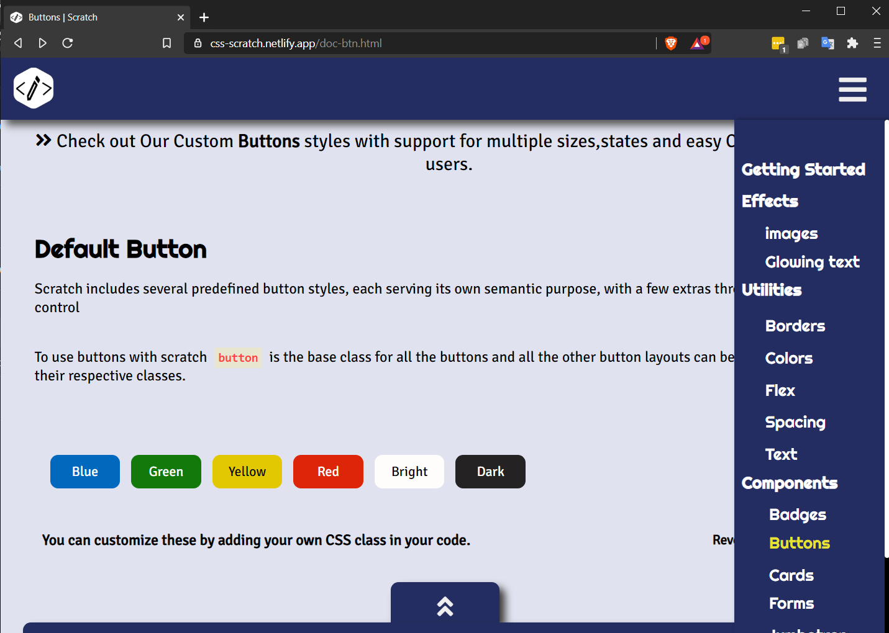

<!-- PROJECT LOGO -->
<br />
<p align="center">
  <a href="https://https://github.com/RuntimeTerror10/Scratch">
    
  </a>

  <h3 align="center">Scratch-A mini CSS Framework</h3>

  <p align="center">
    An awesome CSS framewok to jumpstart your website!
    <br />
    <a href="https://github.com/RuntimeTerror10/Scratch"><strong>Explore the docs »</strong></a>
    <br />
    <br />
   
  </p>
</p>


<!-- TABLE OF CONTENTS -->
<details open="open">
  <summary>Table of Contents</summary>
  <ol>
    <li>
      <a href="#about-the-project">About The Project</a>
      <ul>
        <li><a href="#built-with">Built With</a></li>
      </ul>
    </li>
    <li>
      <a href="#getting-started">Getting Started</a>
      <ul>
        <li><a href="#installation">Installation</a></li>
      </ul>
    </li>
    <li><a href="#contributing">Contributing</a></li>
    <li><a href="#license">License</a></li>
    <li><a href="#contact">Contact</a></li>
    <li><a href="#acknowledgements">Acknowledgements</a></li>
  </ol>
</details>


<!-- ABOUT THE PROJECT -->
## About The Project

<br/>

Scratch is mini CSS framework for giving the users a jumpstart to create a website.
Scratch covers all the major components and utilities to create a website.


Key features:
* Easy to use.
* All components and utilities are made with pure CSS.
* Every component can be easily customized.


### Built With


* HTML
* CSS
* JavaScript


<!-- GETTING STARTED -->
## Getting Started
Adding Scratch's stylesheet is very easy . Just follow the given steps given below.


### Linking the stylesheet to HTML

1. Download the CSS file form the website (https://css-scratch.netlify.app/)
2. Add the stylsheet link above all the other CSS stylesheet links.
   ```sh
   < link rel="stylesheet" href="scratch-main.css" >

   ```


<!-- CONTRIBUTING -->
## Contributing

Contributions are what make the open source community such an amazing place to be learn, inspire, and create. Any contributions you make are **greatly appreciated**.

<!-- LICENSE -->
## License

Distributed under the MIT License. See `LICENSE` for more information.


<!-- CONTACT -->
## Contact

Your Name - [@Paarth_08](https://twitter.com/Paarth_08) 

Project Link: [https://github.com/RuntimeTerror10/Scratch](https://github.com/RuntimeTerror10/Scratch)


<!-- ACKNOWLEDGEMENTS -->
## Acknowledgements
* [GitHub Emoji Cheat Sheet](https://www.webpagefx.com/tools/emoji-cheat-sheet)
* [Img Shields](https://shields.io)
* [Choose an Open Source License](https://choosealicense.com)
* [GitHub Pages](https://pages.github.com)
* [Animate.css](https://daneden.github.io/animate.css)
* [Loaders.css](https://connoratherton.com/loaders)
* [Slick Carousel](https://kenwheeler.github.io/slick)
* [Smooth Scroll](https://github.com/cferdinandi/smooth-scroll)
* [Sticky Kit](http://leafo.net/sticky-kit)
* [JVectorMap](http://jvectormap.com)
* [Font Awesome](https://fontawesome.com)


[license-shield]: https://img.shields.io/github/license/othneildrew/Best-README-Template.svg?style=for-the-badge
[license-url]: https://github.com/othneildrew/Best-README-Template/blob/master/LICENSE.txt

